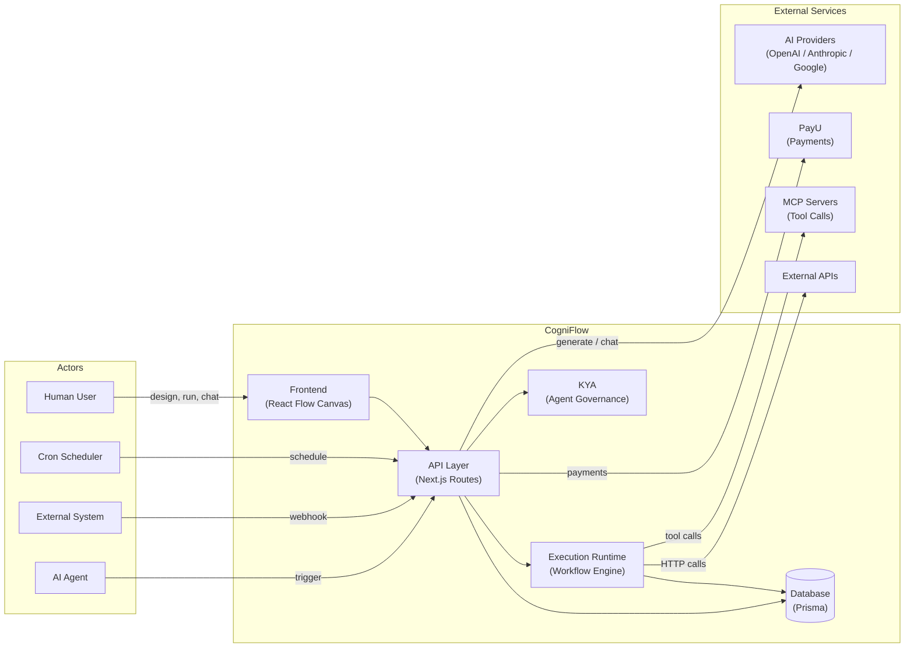
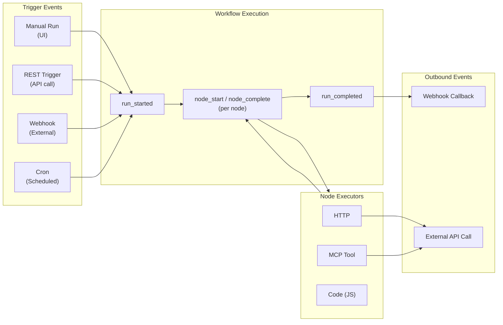

# CogniFlow -- High-Level Architecture

CogniFlow is a **visual BPMN workflow automation platform** with AI-powered generation, agent commerce (PayU), and multi-protocol integrations (HTTP, MCP, Kafka). Users design workflows on a drag-and-drop canvas and execute them via manual triggers, webhooks, cron schedules, or REST API calls.

---

## Actors

| Actor               | Description                                                                                                                  |
| ------------------- | ---------------------------------------------------------------------------------------------------------------------------- |
| **Human User**      | Designs, edits, publishes, and manually runs workflows via the web UI                                                        |
| **AI Assistant**    | Generates workflows from natural language, validates them, and provides chat-based refinement (OpenAI / Anthropic / Google)  |
| **AI Agent (KYA)**  | Autonomous agent with a passport, mandates, and spending limits that can trigger workflows and make payments via PayU        |
| **External System** | Any third-party service that triggers workflows via webhooks or REST API, or is called by workflow nodes (HTTP integrations) |
| **Cron Scheduler**  | External cron caller (e.g. Vercel Cron) that hits `/api/cron` to execute due scheduled workflows                             |
| **PayU**            | Payment platform providing payment processing for agent onboarding and capture flows                                         |
| **MCP Server**      | Model Context Protocol server (stdio or HTTP transport) providing tool-call capabilities to workflow nodes                   |

---

## Systems

### 1. Frontend (Next.js App Router + React 19)

- **Workflow Canvas** -- React Flow-based drag-and-drop BPMN editor (nodes: Start, End, Task, Gateway, Event, Webhook, Logic, Action)
- **Inspector Panel** -- Node properties editor + AI chat panel
- **Sidebar** -- Node palette organized by category (events, tasks, gateways, integrations, logic)
- **Execution UI** -- Run dialog, live SSE execution trace, execution history
- **Settings UI** -- Credentials, Integrations, Schedules, Webhooks, Agent Registry
- **Make My Trip** -- Demo travel planning page with AI itinerary generation and PayU payment agent flow
- **State**: Zustand stores (workflow, UI, execution, integration, validation)

### 2. API Layer (Next.js API Routes)

- **Workflow CRUD** -- `/api/workflows`, `/api/workflows/[id]`, publish, trigger
- **Execution Engine** -- `/api/execute` (SSE streaming), `/api/validate-run`, `/api/executions`
- **AI Services** -- `/api/ai/generate`, `/api/ai/chat` (streaming), `/api/ai/validate`
- **Webhook Ingress** -- `/api/webhooks/[path]`
- **Cron Runner** -- `/api/cron`
- **Agent/KYA APIs** -- `/api/agents` (CRUD, verify, mandates, audit, anomaly-check, revoke)
- **PayU APIs** -- `/api/payu/callback`, `/api/payu/capture`
- **Settings APIs** -- `/api/credentials`, `/api/integrations`, `/api/schedules`, `/api/mcp-servers`
- **Travel Demo** -- `/api/travel/plan`, `/api/travel/book`, `/api/travel/mock/*`
- **BPMN Import** -- `/api/bpmn/import`

### 3. Workflow Execution Runtime

**Key file:** `src/lib/execution/runtime.ts`

The core engine that traverses workflow graphs node-by-node, resolving expressions (`{{nodeId.field}}`), dispatching to executors, and managing execution context.

- **Executor Registry** (`src/lib/execution/executor-registry.ts`) -- dispatches to the correct executor by integration type
- **Executors**: HTTP, MCP Tool, Code (JS), Mock, Webhook (passthrough)
- **Expression Engine** (`src/lib/execution/expression.ts`) -- resolves `{{...}}` templates from `ExecutionContext`
- **Loop Utils** (`src/lib/workflow/loop-utils.ts`) -- handles loop/iteration constructs in workflows

### 4. Database (PostgreSQL / SQLite)

**Schema:** `prisma/schema.prisma`

Prisma ORM with models:

- `Workflow`, `ExecutionRun`, `ValidationRun`
- `Integration`, `Credential` (encrypted)
- `WebhookEndpoint`, `Schedule`
- `McpServerConfig`
- `AgentPassport`, `AgentMandate`, `AgentAuditLog`

### 5. AI Subsystem

**Key files:** `src/lib/ai/`

- **Providers** (`src/lib/ai/providers.ts`) -- OpenAI (`gpt-4o`), Anthropic (`claude-sonnet-4-20250514`), Google (`gemini-2.0-flash`) with fallback chain
- **Prompts** (`src/lib/ai/prompts.ts`) -- system prompts for BPMN generation, chat refinement, and validation test generation
- **BPMN Schema** (`src/lib/ai/bpmn-schema.ts`) -- Zod schema constraining AI-generated workflow structure

### 6. KYA (Know Your Agent) Subsystem

**Key files:** `src/lib/agents/`, `src/lib/crypto/`

- **Agent Passport** -- fingerprint-based identity for AI agents
- **Mandate Engine** -- spending limits, allowed actions, validation
- **Anomaly Detector** (`src/lib/agents/anomaly-detector.ts`) -- scores agent actions, auto-revokes on threshold breach
- **Audit Trail** (`src/lib/agents/audit.ts`) -- logs all agent actions

---

## Events and Data Flows

### Workflow Trigger Events

| Event               | Source                     | Entry Point                        | Behavior                                                                      |
| ------------------- | -------------------------- | ---------------------------------- | ----------------------------------------------------------------------------- |
| **Manual Run**      | Human User via UI          | `POST /api/execute`                | Creates `ExecutionRun`, streams progress via SSE                              |
| **REST Trigger**    | External System / AI Agent | `POST /api/workflows/[id]/trigger` | Creates run, executes async, optionally POSTs result to callback `webhookUrl` |
| **Webhook Trigger** | External System            | `POST /api/webhooks/[path]`        | Looks up `WebhookEndpoint`, creates run, executes async                       |
| **Cron Trigger**    | Cron Scheduler             | `GET /api/cron`                    | Finds due schedules, executes workflows, recomputes `nextRunAt`               |

### Execution Events (SSE Stream)

During workflow execution, the runtime emits these events over SSE to the frontend:

- `run_started` -- execution begins
- `node_start` -- a node begins processing
- `node_complete` -- a node finishes successfully
- `node_error` -- a node fails
- `run_completed` -- entire workflow finishes
- `run_error` -- entire workflow fails

### AI Events

- **Generate** -- user prompt in, BPMN workflow object out (single request/response)
- **Chat** -- user message in, streamed AI tokens out (SSE via Vercel AI SDK)
- **Validate** -- workflow in, test cases out (single request/response)

### Outbound Events

- **Webhook Callback** -- when a triggered workflow completes, POSTs `{ runId, status, output }` to the end-event `webhookUrl`
- **HTTP Executor** -- calls external REST APIs as part of workflow execution
- **MCP Tool Call** -- invokes MCP server tools (stdio or HTTP transport)

---

## Architecture Diagram (Presentation)

---

## Event Flow Diagram (Presentation)

---

## Key Files

| Area | File |
| ---- | ---- |
| Execution Runtime | `src/lib/execution/runtime.ts` |
| Executor Registry | `src/lib/execution/executor-registry.ts` |
| Workflow Types | `src/lib/workflow/types.ts` |
| AI Providers | `src/lib/ai/providers.ts` |
| KYA Agents | `src/lib/agents/audit.ts`, `src/lib/agents/anomaly-detector.ts` |
| Crypto Utils | `src/lib/crypto/fingerprint.ts` |
| Prisma Schema | `prisma/schema.prisma` |
| Workflow Store | `src/lib/store/workflow-store.ts` |
